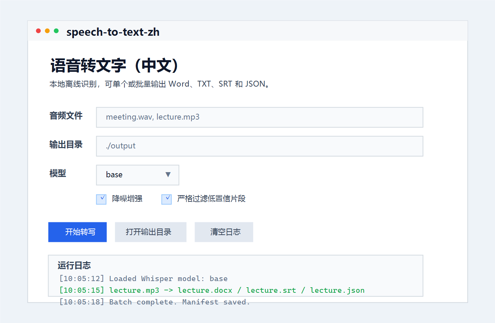
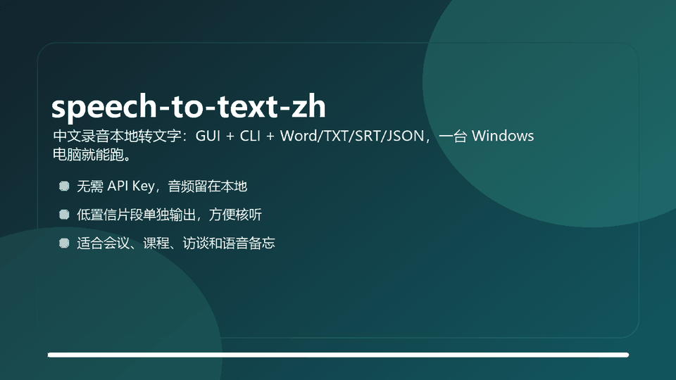

# speech-to-text-zh

[](LICENSE)
[](#)
[](#)
[](https://github.com/yystudio-cyber/speech-to-text-zh/actions/workflows/ci.yml)

Drag in Chinese meeting, class, interview, or voice-note audio on Windows and get local TXT, Word, SRT, JSON, and batch outputs without an API key.

`speech-to-text-zh` is a Chinese-first desktop wrapper around Whisper. It is built for people who want a small local transcription tool instead of a command-line research demo: open the GUI, pick audio, choose a model, and review conservative outputs that separate low-confidence segments from the final transcript.



## Demo



## Fast Start

Download the latest Windows package from [Releases](https://github.com/yystudio-cyber/speech-to-text-zh/releases), or run from source:

```bat
git clone https://github.com/yystudio-cyber/speech-to-text-zh.git
cd speech-to-text-zh
install_deps.bat
run.bat
```

CLI users can install it as a local command:

```bat
python -m pip install .
speech-to-text-zh "C:\path\to\audio.m4a" --output ".\output" --model base --enhance --strict
```

Batch mode:

```bat
speech-to-text-zh "C:\audio\a.m4a" "C:\audio\b.mp3" --output ".\output" --model base
```

## What You Get

- `*_语音转文字结果.docx`: Word report with quality summary, final transcript, and low-confidence candidates
- `*_正式转写.txt`: clean human-readable transcript
- `*_低置信候选.txt`: segments that should be manually checked
- `*_正式转写.srt`: subtitle file
- `*_report.json`: structured run summary
- `*_raw.json`: raw Whisper output for debugging
- `batch_manifest_*.json`: batch processing manifest

See [examples/sample-output](examples/sample-output) for a tiny demo output set.

## Why Use This Instead Of Raw Whisper?

| Need | speech-to-text-zh | Raw Whisper CLI | Online transcription |
|---|---|---|---|
| Chinese Windows desktop workflow | Built in | Manual setup | Usually easy |
| Local-first, no API key | Yes | Yes | Usually no |
| GUI for non-developers | Yes | No | Usually yes |
| Word/TXT/SRT/JSON in one run | Yes | Partial | Depends |
| Low-confidence segments separated | Yes | No | Rare |
| Batch manifest | Yes | Manual scripting | Depends |

## Features

- Local transcription with `openai-whisper`
- Tkinter GUI for desktop use
- CLI for scripting and batch jobs
- Optional denoise enhancement with `ffmpeg`
- Conservative filtering for low-confidence or hallucinated segments
- Word, TXT, SRT, JSON, and batch manifest output
- Quality summary per run so you can tell when manual review is needed

## Recommended Settings

- Start with `base` for a good Chinese speed/quality balance on most Windows laptops.
- Try `small` when accuracy matters more than speed.
- Use `--enhance` for noisy recordings.
- Use `--strict` when you prefer missing uncertain text over mixing hallucinations into the final transcript.

Poor audio, distance, noise, overlapping speakers, or dialect-heavy clips may still require manual review.

## Developer Workflow

```bat
python -m compileall -q app.py speech_to_text_zh tests
python -m unittest discover -s tests -v
```

The repo includes GitHub Actions for lightweight CI and a manual Windows executable build. When a new GitHub Release is published, the build workflow attaches `speech-to-text-zh.exe` as a release asset.

## Roadmap

- Add a short GIF showing audio import, transcription, and output files
- Add packaged Windows release assets for every stable version
- Add more real-world Chinese sample outputs
- Add optional faster-whisper backend when packaging stays simple enough

## Community And Discovery

If this tool helps you, a GitHub star and a short issue with your use case are both useful. Good places to discuss or compare similar tools:

- [GitHub topic: whisper](https://github.com/topics/whisper)
- [GitHub topic: speech-to-text](https://github.com/topics/speech-to-text)
- [GitHub topic: transcription](https://github.com/topics/transcription)
- [awesome-whisper](https://github.com/sindresorhus/awesome-whisper)

## Contributing

Small improvements are welcome: clearer Chinese copy, packaging fixes, sample outputs, and Windows compatibility reports are especially helpful. See [CONTRIBUTING.md](CONTRIBUTING.md).

## License

MIT
