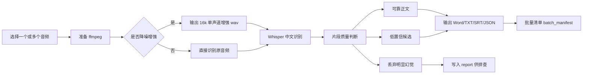

# 设计说明

## 目标

做一个简单、可维护、适合 Windows 桌面双击使用的中文语音转文字小程序。

## 核心流程

## 关键经验

1. 不要随便给 Whisper 加长提示词。低质量音频下，提示词可能被模型“抄进”转写结果。
2. 长录音里某一段幻觉会污染后续片段，所以默认关闭 `condition_on_previous_text`。
3. 自动识别不应假装可靠。低置信内容必须和正式正文分开。
4. 录音质量差时，降噪增强只能改善一部分问题，不能替代人工核听。
5. 批量转写时只加载一次 Whisper 模型，后续文件复用模型，减少等待时间。
6. 每个文件都写质量摘要，方便先挑“需要人工核听”的结果处理。

## 主要文件

- `app.py`：主程序，包含 GUI、音频预处理、Whisper 调用、结果过滤和导出。
- `run.bat`：双击启动。
- `install_deps.bat`：安装 Python 依赖。
- `requirements.txt`：依赖列表。
- `self_check.py`：检查当前环境是否具备运行条件。
- `output/`：默认输出目录，程序运行时自动创建。

## 后续可以增强的方向

- 支持 `faster-whisper` 作为可选后端，提高 CPU 转写速度。
- 增加说话人分离。
- 增加拖拽文件。
- 增加人工校对界面，把音频时间轴和文本联动起来。
- 增加失败重试入口，只重跑批量清单中失败的文件。
